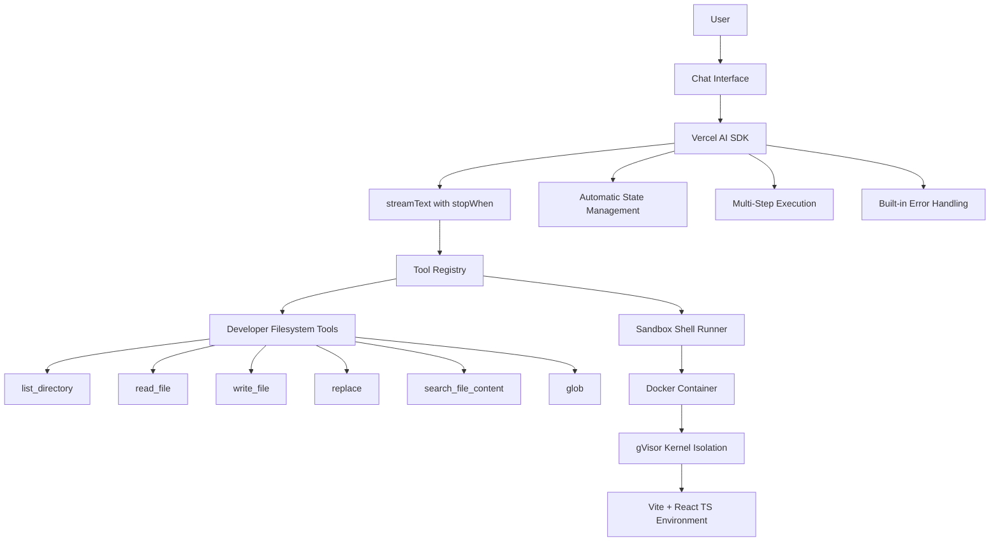
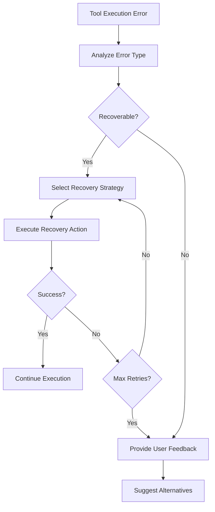

# Design Document

## Overview

This design document outlines the technical architecture for refactoring the AI-powered landing page builder into a true agentic system. The new architecture leverages Vercel AI SDK's built-in multi-step capabilities (`stopWhen: stepCountIs(n)`) and replaces abstract DOM manipulation tools with filesystem-based developer tools following the proven Gemini coding agent pattern.

**Key Insight:** Vercel AI SDK already provides robust agentic capabilities through:

- Multi-step tool execution with `stopWhen: stepCountIs(n)`
- Automatic tool result integration back into the conversation
- Built-in ReAct-style loops without custom implementation
- Tool execution tracking and state management
- Error handling and recovery mechanisms

This means we can focus on implementing the right tools rather than building complex orchestration logic.

## Architecture

### High-Level Architecture (Leveraging Vercel AI SDK)



### Core Components

#### 1. Vercel AI SDK Integration

Leverages the built-in agentic capabilities of Vercel AI SDK instead of custom implementation.

**Key Features Used:**

- `streamText` with `stopWhen: stepCountIs(n)` for multi-step execution
- Automatic tool result integration back into conversation context
- Built-in state management and message history tracking
- Native error handling and recovery mechanisms
- Tool execution tracking through `onStepFinish` callbacks

**Configuration Example:**

```typescript
const result = streamText({
  model: openai('gpt-4o'),
  messages: convertToModelMessages(messages),
  stopWhen: stepCountIs(10), // Allow up to 10 steps for complex tasks
  tools: {
    list_directory: listDirectoryTool,
    read_file: readFileTool,
    write_file: writeFileTool,
    replace: replaceTextTool,
    search_file_content: searchFileContentTool,
    glob: findFilesTool,
  },
  onStepFinish: async ({ toolResults, finishReason }) => {
    // Log tool execution for monitoring
    console.log('Step completed:', { toolResults, finishReason });
  },
});
```

#### 2. Developer Filesystem Tools Registry

Implements the proven coding agent tool pattern with confirmation workflows, following the reference implementation in `tools_example_gemini/` folder.

**Reference Implementation:**
The `tools_example_gemini/` folder in the project root contains reference implementations of all 6 filesystem tools that should be used as the foundation for this implementation:

- `ls.ts` - list_directory tool
- `read-file.ts` - read_file tool
- `write-file.ts` - write_file tool
- `edit.ts` - replace tool
- `grep.ts` - search_file_content tool
- `glob.ts` - glob tool

**Tool Categories:**

- **Safe Tools** (no confirmation): `list_directory`, `read_file`, `search_file_content`, `glob`
- **Destructive Tools** (require confirmation): `write_file`, `replace`

**Tool Interface Pattern:**

```typescript
interface FilesystemTool {
  name: string;
  displayName: string;
  description: string;
  inputSchema: ZodSchema;
  execute: (input: any) => Promise<{ content: string }>;
  requiresConfirmation?: boolean;
}
```

#### 3. Sandbox Execution Environment

Secure, isolated environment for running shell commands and managing user projects.

**Security Layers:**

- Docker containerization for process isolation
- gVisor kernel isolation for additional security
- Non-root user execution (uid 1000)
- Resource limits (CPU, memory, execution time)
- Network isolation and restricted external access

**Base Environment:**

- Vite + React TypeScript development stack
- Pre-installed development tools and dependencies
- Optimized for fast startup and efficient resource usage

#### 4. Legacy ReAct Loop Engine (Deprecated)

Implements the Reason-Act-Observe pattern for multi-step task execution.

**Reasoning Phase:**

- Analyze user request and current project state
- Decompose complex tasks into sequential steps
- Plan tool execution sequence
- Identify dependencies and prerequisites

**Action Phase:**

- Execute selected tool with appropriate parameters
- Validate tool parameters before execution
- Handle tool-specific error conditions

**Observation Phase:**

- Process tool execution results
- Update project state and context
- Determine next action or completion
- Trigger error recovery if needed

#### 3. State Management System

Maintains comprehensive awareness of project state and execution context.

**Project State Tracking:**

- Current file structure and contents
- Recent modifications and their impact
- Active development patterns and conventions
- Asset organization and references

**Execution Context:**

- Tool execution history and outcomes
- Successful pattern recognition
- Error patterns and recovery strategies
- User preferences and feedback

## Components and Interfaces

### Filesystem Tools (Gemini-Style)

#### list_directory Tool (ReadFolder)

**Tool name:** `list_directory` | **Display name:** ReadFolder | **File:** `ls.ts`

```typescript
interface ListDirectoryInput {
  path: string; // Absolute path to directory
  ignore?: string[]; // Glob patterns to exclude (e.g., ["*.log", ".git"])
  respect_git_ignore?: boolean; // Default: true
}
```

**Output:** String format: `"Directory listing for /path:\n[DIR] subfolder\nfile.txt"`
**Confirmation:** No

#### read_file Tool (ReadFile)

**Tool name:** `read_file` | **Display name:** ReadFile | **File:** `read-file.ts`

```typescript
interface ReadFileInput {
  path: string; // Absolute path to file
  offset?: number; // 0-based line number to start from
  limit?: number; // Max lines to read (default: 2000)
}
```

**Output:** Text content or base64 for images/PDFs
**Confirmation:** No

#### write_file Tool (WriteFile)

**Tool name:** `write_file` | **Display name:** WriteFile | **File:** `write-file.ts`

```typescript
interface WriteFileInput {
  file_path: string; // Absolute path to file
  content: string; // Content to write
}
```

**Output:** Success message (e.g., "Successfully created and wrote to new file")
**Confirmation:** Yes (shows diff before writing)

#### replace Tool (Edit)

**Tool name:** `replace` | **Display name:** Edit | **File:** `edit.ts`

```typescript
interface ReplaceInput {
  file_path: string; // Absolute path to file
  old_string: string; // Exact text to replace (with 3+ lines context)
  new_string: string; // Replacement text
  expected_replacements?: number; // Default: 1
}
```

**Output:** Success/failure message with replacement count
**Confirmation:** Yes (shows diff before editing)
**Special:** Multi-stage edit correction for improved reliability

#### search_file_content Tool (SearchText)

**Tool name:** `search_file_content` | **Display name:** SearchText | **File:** `grep.ts`

```typescript
interface SearchFileContentInput {
  pattern: string; // Regex pattern to search
  path?: string; // Directory to search (default: current)
  include?: string; // Glob pattern for file filtering
}
```

**Output:** Formatted matches: `"File: src/utils.ts L15: export function myFunction()"`
**Confirmation:** No

#### glob Tool (FindFiles)

**Tool name:** `glob` | **Display name:** FindFiles | **File:** `glob.ts`

```typescript
interface GlobInput {
  pattern: string; // Glob pattern (e.g., "*.ts", "src/**/*.js")
  path?: string; // Directory to search
  case_sensitive?: boolean; // Default: false
  respect_git_ignore?: boolean; // Default: true
}
```

**Output:** List of matching files, sorted by modification time (newest first)
**Confirmation:** No

### Sandbox Architecture

#### Container Management

```typescript
interface SandboxContainer {
  id: string;
  userId: string;
  status: 'provisioning' | 'ready' | 'running' | 'stopped';
  createdAt: Date;
  lastActivity: Date;
  resourceLimits: ResourceLimits;
}

interface ResourceLimits {
  cpuLimit: string; // e.g., "1.0" for 1 CPU core
  memoryLimit: string; // e.g., "512Mi" for 512MB
  executionTimeout: number; // seconds
  diskQuota: string; // e.g., "1Gi" for 1GB
}
```

#### Sandbox Provisioning

```typescript
interface SandboxProvisionRequest {
  userId: string;
  projectId: string;
  baseImage: string; // "vite-react-ts:latest"
  resourceLimits: ResourceLimits;
}

interface SandboxProvisionResponse {
  containerId: string;
  status: 'ready' | 'failed';
  endpoint: string;
  error?: string;
}
```

## Data Models

### Project State Model

```typescript
interface ProjectState {
  projectId: string;
  userId: string;
  currentFiles: Map<string, FileState>;
  recentChanges: ChangeHistory[];
  buildStatus: BuildStatus;
  dependencies: PackageInfo[];
}

interface FileState {
  path: string;
  content: string;
  lastModified: Date;
  size: number;
  checksum: string;
}

interface ChangeHistory {
  timestamp: Date;
  toolUsed: string;
  filesAffected: string[];
  description: string;
  success: boolean;
}
```

### Tool Execution Model

```typescript
interface ToolExecution {
  id: string;
  toolName: string;
  input: any;
  output: any;
  startTime: Date;
  endTime: Date;
  success: boolean;
  error?: string;
  retryCount: number;
}

interface ExecutionSequence {
  id: string;
  userRequest: string;
  steps: ToolExecution[];
  status: 'planning' | 'executing' | 'completed' | 'failed';
  currentStep: number;
}
```

## Error Handling

### Error Recovery Strategies

#### Tool Execution Failures

1. **Parameter Validation Errors**
   - Automatically correct common parameter issues
   - Suggest alternative parameter values
   - Fall back to safer tool variants

2. **File Operation Errors**
   - Retry with different file paths
   - Create missing directories automatically
   - Use backup files when available

3. **Syntax Validation Errors**
   - Attempt automatic syntax correction
   - Revert to last known good state
   - Provide detailed error explanations

#### Sandbox Failures

1. **Container Provisioning Failures**
   - Retry with different resource allocations
   - Fall back to alternative base images
   - Queue requests during high load

2. **Resource Limit Exceeded**
   - Gracefully terminate long-running processes
   - Provide clear resource usage feedback
   - Suggest optimization strategies

3. **Network Isolation Issues**
   - Validate network policies
   - Restart container networking
   - Provide offline alternatives

### Error Recovery Flow



## Testing Strategy

### Unit Testing

- **Tool Functions**: Test each filesystem tool independently
- **ReAct Loop**: Test reasoning, action, and observation phases
- **State Management**: Test state updates and consistency
- **Error Recovery**: Test failure scenarios and recovery paths

### Integration Testing

- **Tool Chaining**: Test multi-step tool execution sequences
- **Sandbox Integration**: Test container provisioning and command execution
- **State Persistence**: Test state management across tool executions
- **Error Propagation**: Test error handling across component boundaries

### End-to-End Testing

- **User Scenarios**: Test complete user request workflows
- **Complex Tasks**: Test multi-file, multi-step operations
- **Error Scenarios**: Test recovery from various failure conditions
- **Performance**: Test execution time and resource usage

### Security Testing

- **Sandbox Isolation**: Verify container isolation and security
- **Resource Limits**: Test enforcement of CPU, memory, and time limits
- **File Access**: Verify filesystem access restrictions
- **Network Isolation**: Test network security boundaries

## Performance Considerations

### Tool Execution Optimization

- **Caching**: Cache file contents and search results
- **Batching**: Combine related file operations
- **Lazy Loading**: Load file contents only when needed
- **Parallel Execution**: Execute independent tools concurrently

### Sandbox Performance

- **Image Optimization**: Pre-build optimized base images
- **Container Reuse**: Reuse containers for sequential operations
- **Resource Pooling**: Maintain pool of ready containers
- **Cleanup Scheduling**: Efficient container lifecycle management

### State Management Efficiency

- **Incremental Updates**: Update only changed state portions
- **Compression**: Compress large state objects
- **Persistence Strategy**: Efficient state serialization
- **Memory Management**: Garbage collection for old state

## Security Architecture

### Sandbox Security Layers

#### Container Isolation (Docker)

- Process isolation using Linux namespaces
- Filesystem isolation with read-only base layers
- Network isolation with custom bridge networks
- Resource limits enforced by cgroups

#### Kernel Isolation (gVisor)

- Additional kernel-level isolation
- System call interception and filtering
- Protection against container escape attacks
- Reduced attack surface compared to standard containers

#### Application Security

- Non-root user execution (uid 1000)
- Minimal privilege principle
- Secure file permissions (644 for files, 755 for directories)
- Environment variable sanitization

### Multi-Tenant Isolation

#### User Separation

- Unique container instances per user session
- Isolated filesystem namespaces
- Separate network namespaces
- Independent resource quotas

#### Data Protection

- Encrypted data at rest
- Secure data transmission
- Automatic data cleanup on session end
- No cross-user data access

#### Resource Management

- Per-user CPU and memory limits
- Execution time restrictions
- Disk usage quotas
- Network bandwidth limits

## Deployment Architecture

### Container Base Image

```dockerfile
FROM node:18-alpine

# Install system dependencies
RUN apk add --no-cache git curl

# Create non-root user
RUN addgroup -g 1000 developer && \
    adduser -D -s /bin/sh -u 1000 -G developer developer

# Set up Vite + React TypeScript environment
WORKDIR /workspace
COPY package.json package-lock.json ./
RUN npm ci --only=production

# Install development tools
RUN npm install -g @vitejs/create-vite typescript

# Set permissions
RUN chown -R developer:developer /workspace
USER developer

EXPOSE 5173
CMD ["npm", "run", "dev"]
```

### Simple Docker Architecture

**Single Container Per User Session:**

When a user requests a session, the main application creates a lightweight container with Vite + React TypeScript environment.

```bash
# Build the sandbox base image (Vite + React TS)
docker build -t agentic-sandbox-base:latest -f Dockerfile.sandbox .

# Main application runs normally (no Docker Compose needed)
npm start
```

**User Session Container Creation:**

```typescript
// When user starts a session
const userContainer = await docker.createContainer({
  Image: 'agentic-sandbox-base:latest',
  User: '1000:1000', // Non-root user
  WorkingDir: '/workspace',
  Env: [`USER_ID=${userId}`, `SESSION_ID=${sessionId}`],
  HostConfig: {
    Memory: 256 * 1024 * 1024, // 256MB limit (lightweight SPA)
    CpuQuota: 25000, // 0.25 CPU cores
    NetworkMode: 'bridge',
    PortBindings: {
      '5173/tcp': [{ HostPort: '0' }], // Random port for Vite dev server
    },
  },
  ExposedPorts: { '5173/tcp': {} },
  Labels: {
    'agentic.user': userId,
    'agentic.session': sessionId,
  },
});

await userContainer.start();

// Clone existing code if available, then start Vite dev server
await userContainer.exec({
  Cmd: ['npm', 'run', 'dev'],
  AttachStdout: true,
  AttachStderr: true,
});
```

**Session Workflow:**

1. **User Request** → Main app creates container
2. **Code Setup** → Clone existing project or create new SPA
3. **Dev Server** → Start Vite dev server (lightweight, fast)
4. **Preview Panel** → User loads the running SPA via exposed port
5. **AI Tools** → Modify files in container, hot-reload updates preview
6. **Cleanup** → Remove container after session ends

**Benefits:**

- **Lightweight**: Only SPA apps, minimal resource usage
- **Fast Startup**: Vite dev server starts quickly
- **Hot Reload**: Changes reflect immediately in preview
- **Simple**: No orchestration needed, just Docker API calls

This design provides a comprehensive technical foundation for implementing the agentic landing page builder with secure sandbox execution, filesystem-based tools, and robust multi-step task execution capabilities.
