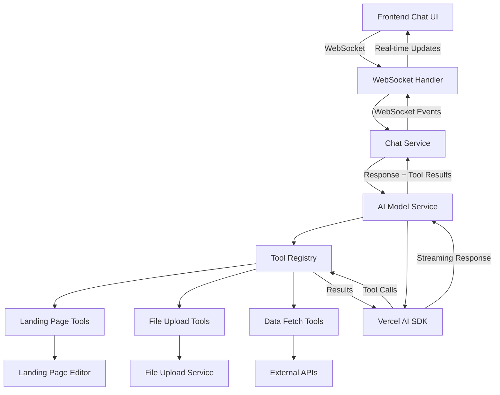

# Design Document

## Overview

This design document outlines the implementation of Tool Calling functionality for the InstaBuild AI assistant using the Vercel AI SDK. The solution extends the existing AI model and chat services to support dynamic tool execution, enabling the AI to perform actions like modifying landing page elements, uploading files, and fetching data through natural language interactions.

The design leverages the Vercel AI SDK's native tool calling capabilities with streaming support, integrating seamlessly with the existing WebSocket-based chat architecture while maintaining type safety and error handling.

## Architecture

### High-Level Architecture



### Component Interaction Flow

1. **User Input**: User sends message through WebSocket
2. **Message Processing**: Chat Service processes message and determines if tools are needed
3. **AI Invocation**: AI Model Service calls Vercel AI SDK with available tools
4. **Tool Execution**: SDK identifies required tools and executes them via Tool Registry
5. **Result Integration**: Tool results are integrated into AI response
6. **Streaming Response**: Complete response with tool results streams back to frontend

## Components and Interfaces

### Tool Registry

The Tool Registry serves as the central hub for managing all available tools, providing registration, validation, and execution capabilities.

```typescript
interface ToolDefinition<T = any> {
  name: string;
  description: string;
  inputSchema: z.ZodSchema<T>;
  execute: (input: T, context: ToolExecutionContext) => Promise<any> | any;
  permissions?: string[];
  timeout?: number;
  rateLimitKey?: string;
}

interface ToolExecutionContext {
  userId: string;
  conversationId: string;
  toolCallId: string;
  pageId?: string;
  selectedElementId?: string;
}

interface ToolRegistry {
  registerTool<T>(definition: ToolDefinition<T>): void;
  getTools(): Record<string, VercelAITool>;
  executeTool(
    name: string,
    input: any,
    context: ToolExecutionContext
  ): Promise<any>;
  validatePermissions(toolName: string, userId: string): boolean;
}
```

### Enhanced AI Model Service

The AI Model Service is extended to support tool calling while maintaining backward compatibility with existing streaming functionality.

```typescript
interface AIStreamOptionsWithTools extends AIStreamOptions {
  tools?: Record<string, VercelAITool>;
  toolChoice?:
    | 'auto'
    | 'required'
    | { type: 'function'; function: { name: string } };
  maxSteps?: number;
  onToolCall?: (toolCall: ToolCall) => void;
  onToolResult?: (toolResult: ToolResult) => void;
}

interface ToolCall {
  toolCallId: string;
  toolName: string;
  input: any;
}

interface ToolResult {
  toolCallId: string;
  toolName: string;
  output: any;
  error?: string;
}

class AIModelService {
  async *streamChatResponseWithTools(
    options: AIStreamOptionsWithTools
  ): AsyncGenerator<StreamChunk> {
    // Implementation details in tasks
  }

  async executeToolCall(
    toolCall: ToolCall,
    context: ToolExecutionContext
  ): Promise<ToolResult> {
    // Implementation details in tasks
  }
}
```

### WebSocket Message Protocol Extensions

The existing WebSocket protocol is extended to support tool execution events while maintaining compatibility with current message types.

```typescript
// Existing types remain unchanged
interface UserMessage {
  type: 'userMessage';
  conversationId: string;
  content: string;
}

interface AIResponseChunk {
  type: 'aiResponseChunk';
  conversationId: string;
  content: string;
  isLastChunk: boolean;
}

// New tool-related message types
interface ToolExecutionStart {
  type: 'toolExecutionStart';
  conversationId: string;
  toolCallId: string;
  toolName: string;
  input: any;
}

interface ToolExecutionProgress {
  type: 'toolExecutionProgress';
  conversationId: string;
  toolCallId: string;
  status: string;
  progress?: number;
}

interface ToolExecutionComplete {
  type: 'toolExecutionComplete';
  conversationId: string;
  toolCallId: string;
  output: any;
  error?: string;
}

type WSMessage =
  | UserMessage
  | AIResponseChunk
  | ErrorMessage
  | ToolExecutionStart
  | ToolExecutionProgress
  | ToolExecutionComplete;
```

### Landing Page Tools

Specific tools for landing page manipulation, leveraging the existing Landing Page Editor component.

```typescript
interface ElementModificationInput {
  elementId: string;
  modifications: {
    style?: Record<string, string>;
    content?: string;
    attributes?: Record<string, string>;
  };
}

interface ElementCreationInput {
  parentId: string;
  elementType: string;
  properties: Record<string, any>;
  position?: 'before' | 'after' | 'inside';
}

// Tool definitions
const modifyElementTool = tool({
  description:
    'Modify styling, content, or attributes of a landing page element',
  inputSchema: z.object({
    elementId: z.string(),
    modifications: z.object({
      style: z.record(z.string()).optional(),
      content: z.string().optional(),
      attributes: z.record(z.string()).optional(),
    }),
  }),
  execute: async (input, context) => {
    // Implementation delegates to Landing Page Editor
  },
});
```

### File Upload Tools

Tools for handling file uploads and asset management, integrating with the existing File Upload Service.

```typescript
interface FileUploadInput {
  fileType: 'image' | 'video' | 'document';
  fileName: string;
  maxSize?: number;
  allowedFormats?: string[];
}

const uploadFileTool = tool({
  description: 'Upload and process files for use in landing pages',
  inputSchema: z.object({
    fileType: z.enum(['image', 'video', 'document']),
    fileName: z.string(),
    maxSize: z.number().optional(),
    allowedFormats: z.array(z.string()).optional(),
  }),
  execute: async (input, context) => {
    // Implementation delegates to File Upload Service
  },
});
```

## Data Models

### Tool Execution Tracking

```typescript
interface ToolExecution {
  id: string;
  conversationId: string;
  toolCallId: string;
  toolName: string;
  input: any;
  output?: any;
  error?: string;
  status: 'pending' | 'executing' | 'completed' | 'failed' | 'timeout';
  startTime: Date;
  endTime?: Date;
  userId: string;
}

// Database schema extension
model ToolExecution {
  id            String   @id @default(cuid())
  conversationId String
  toolCallId    String   @unique
  toolName      String
  input         Json
  output        Json?
  error         String?
  status        String
  startTime     DateTime @default(now())
  endTime       DateTime?
  userId        String

  conversation  Conversation @relation(fields: [conversationId], references: [id])

  @@map("tool_executions")
}
```

### Enhanced Chat Message Model

```typescript
// Extension to existing ChatMessage model
interface ChatMessageWithTools extends ChatMessage {
  toolCalls?: ToolCall[];
  toolResults?: ToolResult[];
}

// Database schema extension
model ChatMessage {
  // ... existing fields
  toolCalls   Json?  // Array of tool calls
  toolResults Json?  // Array of tool results
}
```

## Error Handling

### Tool Execution Error Types

```typescript
enum ToolErrorType {
  VALIDATION_ERROR = 'validation_error',
  PERMISSION_DENIED = 'permission_denied',
  EXECUTION_ERROR = 'execution_error',
  TIMEOUT_ERROR = 'timeout_error',
  RATE_LIMIT_ERROR = 'rate_limit_error',
  UNKNOWN_TOOL = 'unknown_tool',
}

interface ToolError {
  type: ToolErrorType;
  message: string;
  details?: any;
  retryable: boolean;
}
```

### Error Recovery Strategies

1. **Tool Call Repair**: Use Vercel AI SDK's `experimental_repairToolCall` for invalid parameters
2. **Graceful Degradation**: Fall back to text-only responses when tools fail
3. **User Feedback**: Provide clear error messages and suggested alternatives
4. **Retry Logic**: Implement exponential backoff for retryable errors
5. **Circuit Breaker**: Temporarily disable problematic tools

### Error Handling Implementation

```typescript
class ToolExecutionError extends Error {
  constructor(
    public toolName: string,
    public toolCallId: string,
    public errorType: ToolErrorType,
    message: string,
    public details?: any
  ) {
    super(message);
  }
}

async function executeToolWithErrorHandling(
  toolCall: ToolCall,
  context: ToolExecutionContext
): Promise<ToolResult> {
  try {
    const result = await toolRegistry.executeTool(
      toolCall.toolName,
      toolCall.input,
      context
    );

    return {
      toolCallId: toolCall.toolCallId,
      toolName: toolCall.toolName,
      output: result,
    };
  } catch (error) {
    if (error instanceof ToolExecutionError) {
      return {
        toolCallId: toolCall.toolCallId,
        toolName: toolCall.toolName,
        output: null,
        error: error.message,
      };
    }

    // Handle unexpected errors
    logger.error('Unexpected tool execution error', { error, toolCall });
    return {
      toolCallId: toolCall.toolCallId,
      toolName: toolCall.toolName,
      output: null,
      error: 'An unexpected error occurred during tool execution',
    };
  }
}
```

## Testing Strategy

### Unit Testing

1. **Tool Registry Tests**
   - Tool registration and validation
   - Permission checking
   - Rate limiting
   - Error handling

2. **AI Model Service Tests**
   - Tool call identification and execution
   - Streaming with tool results
   - Error recovery mechanisms
   - Multi-step tool execution

3. **Individual Tool Tests**
   - Input validation
   - Execution logic
   - Error scenarios
   - Performance benchmarks

### Integration Testing

1. **End-to-End Chat Flow**
   - User message → Tool execution → AI response
   - WebSocket message flow
   - Database persistence

2. **Tool Interaction Tests**
   - Multiple tool calls in sequence
   - Parallel tool execution
   - Tool result integration

3. **Error Scenario Testing**
   - Invalid tool parameters
   - Permission denied scenarios
   - Timeout handling
   - Network failures

### Performance Testing

1. **Tool Execution Performance**
   - Individual tool execution times
   - Concurrent tool execution
   - Memory usage during tool calls

2. **Streaming Performance**
   - Latency with tool calls
   - Throughput under load
   - WebSocket connection stability

### Security Testing

1. **Permission Validation**
   - Unauthorized tool access attempts
   - Privilege escalation scenarios
   - Cross-user data access

2. **Input Sanitization**
   - Malicious input handling
   - SQL injection attempts
   - XSS prevention

## Implementation Considerations

### Performance Optimizations

1. **Tool Caching**: Cache tool results for identical inputs within a time window
2. **Lazy Loading**: Load tool definitions only when needed
3. **Connection Pooling**: Reuse database connections for tool executions
4. **Streaming Optimization**: Minimize latency between tool completion and response streaming

### Security Measures

1. **Input Validation**: Strict schema validation for all tool inputs
2. **Rate Limiting**: Per-user and per-tool rate limits
3. **Audit Logging**: Comprehensive logging of all tool executions
4. **Sandboxing**: Isolate tool execution environments where possible

### Scalability Considerations

1. **Horizontal Scaling**: Design tools to be stateless for easy scaling
2. **Load Balancing**: Distribute tool execution across multiple instances
3. **Queue Management**: Use message queues for long-running tool operations
4. **Resource Limits**: Implement memory and CPU limits for tool execution

### Monitoring and Observability

1. **Metrics Collection**: Track tool execution times, success rates, and error rates
2. **Distributed Tracing**: Trace requests across tool executions
3. **Health Checks**: Monitor tool availability and performance
4. **Alerting**: Set up alerts for tool failures and performance degradation
