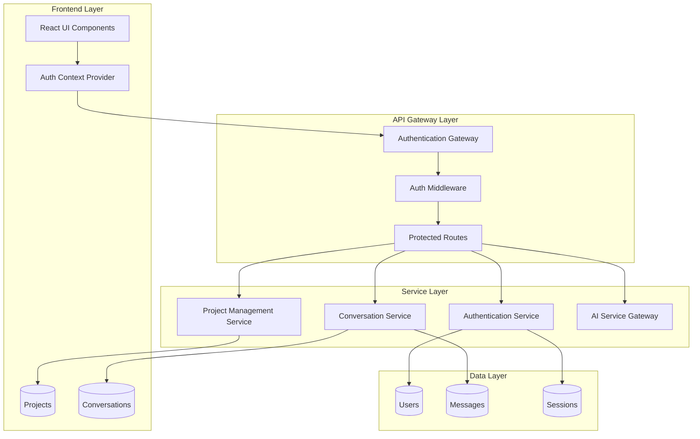
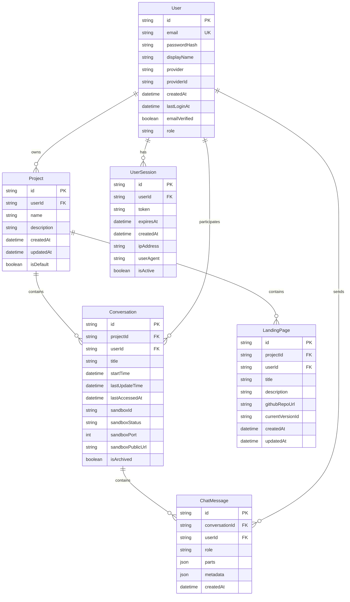

# Design Document

## Overview

This design implements a comprehensive user authentication system with a foundational refactoring of the conversation architecture. The system will transform the current 1:1 conversation-to-landing-page relationship into a flexible multi-conversation-per-project structure, then layer authentication and authorization on top.

The design follows a phased approach:

1. **Phase 1**: Database schema refactoring for multi-conversation support
2. **Phase 2**: Authentication system implementation
3. **Phase 3**: Authorization and project management
4. **Phase 4**: Frontend integration and user experience

## Architecture

### High-Level Architecture



### Database Schema Refactoring

The new schema introduces a `Project` entity that serves as the container for conversations and landing pages:



## Components and Interfaces

### 1. Authentication Service

```typescript
interface AuthenticationService {
  // Registration and login
  register(
    email: string,
    password: string,
    displayName: string
  ): Promise<AuthResult>;
  login(email: string, password: string): Promise<AuthResult>;
  loginWithOAuth(
    provider: 'google' | 'github',
    code: string
  ): Promise<AuthResult>;

  // Session management
  refreshToken(refreshToken: string): Promise<AuthResult>;
  logout(sessionId: string): Promise<void>;
  validateSession(token: string): Promise<User | null>;

  // Password management
  requestPasswordReset(email: string): Promise<void>;
  resetPassword(token: string, newPassword: string): Promise<void>;
  changePassword(
    userId: string,
    currentPassword: string,
    newPassword: string
  ): Promise<void>;
}

interface AuthResult {
  user: User;
  accessToken: string;
  refreshToken: string;
  expiresIn: number;
}
```

### 2. Project Management Service

```typescript
interface ProjectService {
  // Project CRUD
  createProject(
    userId: string,
    name: string,
    description?: string
  ): Promise<Project>;
  getUserProjects(userId: string): Promise<Project[]>;
  getProject(projectId: string, userId: string): Promise<Project | null>;
  updateProject(
    projectId: string,
    userId: string,
    updates: Partial<Project>
  ): Promise<Project>;
  deleteProject(projectId: string, userId: string): Promise<void>;

  // Project context
  setActiveProject(userId: string, projectId: string): Promise<void>;
  getActiveProject(userId: string): Promise<Project | null>;
}

interface Project {
  id: string;
  userId: string;
  name: string;
  description?: string;
  createdAt: Date;
  updatedAt: Date;
  isDefault: boolean;
  conversationCount: number;
  landingPageCount: number;
}
```

### 3. Enhanced Conversation Service

```typescript
interface ConversationService {
  // Conversation management
  createConversation(
    projectId: string,
    userId: string,
    title?: string
  ): Promise<Conversation>;
  getProjectConversations(
    projectId: string,
    userId: string
  ): Promise<Conversation[]>;
  getConversation(
    conversationId: string,
    userId: string
  ): Promise<Conversation | null>;
  updateConversation(
    conversationId: string,
    userId: string,
    updates: ConversationUpdate
  ): Promise<Conversation>;
  archiveConversation(conversationId: string, userId: string): Promise<void>;
  deleteConversation(conversationId: string, userId: string): Promise<void>;

  // Message management
  getConversationMessages(
    conversationId: string,
    userId: string,
    limit?: number
  ): Promise<ChatMessage[]>;
  addMessage(
    conversationId: string,
    userId: string,
    message: MessageInput
  ): Promise<ChatMessage>;

  // Migration utilities
  migrateExistingConversations(): Promise<void>;
}

interface ConversationUpdate {
  title?: string;
  isArchived?: boolean;
}

interface Conversation {
  id: string;
  projectId: string;
  userId: string;
  title: string;
  startTime: Date;
  lastUpdateTime: Date;
  lastAccessedAt: Date;
  sandboxId?: string;
  sandboxStatus?: string;
  sandboxPort?: number;
  sandboxPublicUrl?: string;
  isArchived: boolean;
  messageCount: number;
}
```

### 4. Authentication Middleware

```typescript
interface AuthMiddleware {
  // Request authentication
  authenticate(request: FastifyRequest): Promise<AuthenticatedUser>;
  requireAuth(request: FastifyRequest, reply: FastifyReply): Promise<void>;
  optionalAuth(request: FastifyRequest): Promise<AuthenticatedUser | null>;

  // Authorization checks
  requireProjectAccess(projectId: string, userId: string): Promise<void>;
  requireConversationAccess(
    conversationId: string,
    userId: string
  ): Promise<void>;
  requireRole(
    role: UserRole
  ): (request: FastifyRequest, reply: FastifyReply) => Promise<void>;
}

interface AuthenticatedUser {
  id: string;
  email: string;
  displayName: string;
  role: UserRole;
  activeProjectId?: string;
}

type UserRole = 'admin' | 'user' | 'guest';
```

## Data Models

### User Model

```typescript
interface User {
  id: string;
  email: string;
  passwordHash?: string; // null for OAuth users
  displayName: string;
  provider: 'local' | 'google' | 'github';
  providerId?: string; // OAuth provider user ID
  createdAt: Date;
  lastLoginAt: Date;
  emailVerified: boolean;
  role: UserRole;
  preferences: UserPreferences;
}

interface UserPreferences {
  theme: 'light' | 'dark' | 'system';
  language: string;
  notifications: NotificationSettings;
}
```

### Enhanced Database Schema

```prisma
model User {
  id              String    @id @default(cuid())
  email           String    @unique
  passwordHash    String?   // null for OAuth users
  displayName     String
  provider        String    @default("local") // local, google, github
  providerId      String?   // OAuth provider user ID
  createdAt       DateTime  @default(now())
  lastLoginAt     DateTime?
  emailVerified   Boolean   @default(false)
  role            String    @default("user") // admin, user, guest
  preferences     Json?     // User preferences object

  // Relationships
  projects        Project[]
  conversations   Conversation[]
  chatMessages    ChatMessage[]
  sessions        UserSession[]

  @@map("users")
}

model Project {
  id          String   @id @default(cuid())
  userId      String
  name        String   @db.VarChar(100)
  description String?  @db.VarChar(500)
  createdAt   DateTime @default(now())
  updatedAt   DateTime @updatedAt
  isDefault   Boolean  @default(false)

  // Relationships
  user          User           @relation(fields: [userId], references: [id], onDelete: Cascade)
  conversations Conversation[]
  landingPages  LandingPage[]

  @@index([userId])
  @@map("projects")
}

// Updated Conversation model
model Conversation {
  id             String   @id @default(cuid())
  projectId      String   // Changed from landingPageId to projectId
  userId         String   // Now required
  title          String   @default("New Conversation")
  startTime      DateTime @default(now())
  lastUpdateTime DateTime @updatedAt
  lastAccessedAt DateTime @default(now())
  sandboxId      String?
  sandboxStatus  SandboxStatus? @default(PENDING)
  sandboxCreatedAt DateTime?
  sandboxPublicUrl String?
  sandboxPort    Int?
  isArchived     Boolean  @default(false)

  // Relationships
  project        Project        @relation(fields: [projectId], references: [id], onDelete: Cascade)
  user           User           @relation(fields: [userId], references: [id], onDelete: Cascade)
  messages       ChatMessage[]
  toolExecutions ToolExecution[]
  modelUsage     ModelUsage[]

  @@index([projectId])
  @@index([userId])
  @@index([lastAccessedAt])
  @@map("conversations")
}

// Updated LandingPage model
model LandingPage {
  id               String   @id @default(cuid())
  projectId        String   // New: associate with project instead of direct conversation
  userId           String   // New: direct user association
  title            String   @db.VarChar(100)
  description      String?  @db.VarChar(500)
  githubRepoUrl    String
  currentVersionId String?
  createdAt        DateTime @default(now())
  updatedAt        DateTime @updatedAt

  // Relationships
  project        Project              @relation(fields: [projectId], references: [id], onDelete: Cascade)
  user           User                 @relation(fields: [userId], references: [id], onDelete: Cascade)
  versions       LandingPageVersion[]
  currentVersion LandingPageVersion?  @relation("CurrentVersion", fields: [currentVersionId], references: [id])

  @@index([projectId])
  @@index([userId])
  @@map("landing_pages")
}

// Updated ChatMessage model
model ChatMessage {
  id             String   @id @default(cuid())
  conversationId String
  userId         String   // Now required
  role           String   @db.VarChar(20)
  parts          Json?
  metadata       Json?
  createdAt      DateTime @default(now())

  // Relationships
  conversation         Conversation          @relation(fields: [conversationId], references: [id], onDelete: Cascade)
  user                 User                  @relation(fields: [userId], references: [id], onDelete: Cascade)
  modificationCommands ModificationCommand[]
  toolExecutions       ToolExecution[]

  @@index([conversationId])
  @@index([userId])
  @@map("chat_messages")
}

model UserSession {
  id        String   @id @default(cuid())
  userId    String
  token     String   @unique
  expiresAt DateTime
  createdAt DateTime @default(now())
  ipAddress String?
  userAgent String?
  isActive  Boolean  @default(true)

  // Relationships
  user User @relation(fields: [userId], references: [id], onDelete: Cascade)

  @@index([userId])
  @@index([token])
  @@index([expiresAt])
  @@map("user_sessions")
}
```

## Error Handling

### Authentication Errors

```typescript
enum AuthErrorCode {
  INVALID_CREDENTIALS = 'INVALID_CREDENTIALS',
  USER_NOT_FOUND = 'USER_NOT_FOUND',
  EMAIL_ALREADY_EXISTS = 'EMAIL_ALREADY_EXISTS',
  INVALID_TOKEN = 'INVALID_TOKEN',
  TOKEN_EXPIRED = 'TOKEN_EXPIRED',
  SESSION_EXPIRED = 'SESSION_EXPIRED',
  INSUFFICIENT_PERMISSIONS = 'INSUFFICIENT_PERMISSIONS',
  PROJECT_NOT_FOUND = 'PROJECT_NOT_FOUND',
  CONVERSATION_NOT_FOUND = 'CONVERSATION_NOT_FOUND',
  UNAUTHORIZED_ACCESS = 'UNAUTHORIZED_ACCESS',
}

interface AuthError extends Error {
  code: AuthErrorCode;
  statusCode: number;
  details?: any;
}
```

### Error Response Format

```typescript
interface ErrorResponse {
  error: string;
  code: AuthErrorCode;
  message: string;
  details?: any;
  timestamp: string;
  requestId: string;
}
```

## Testing Strategy

### Unit Tests

- Authentication service methods
- Password hashing and validation
- JWT token generation and validation
- Database model validations
- Authorization middleware functions

### Integration Tests

- Complete authentication flows (register, login, logout)
- OAuth integration with mock providers
- Database migration scripts
- API endpoint authentication
- Session management across requests

### End-to-End Tests

- User registration and email verification
- Login with email/password and OAuth
- Project creation and conversation management
- Multi-conversation workflows
- Session expiration and renewal
- Password reset flow

### Migration Testing

- Existing data preservation during schema changes
- Backward compatibility during transition period
- Performance impact of new indexes
- Data integrity validation post-migration

## Security Considerations

### Authentication Security

- Passwords hashed with bcrypt (cost factor 12)
- JWT tokens with short expiration (15 minutes access, 7 days refresh)
- Secure HTTP-only cookies for token storage
- CSRF protection with double-submit cookies
- Rate limiting on authentication endpoints

### Authorization Security

- Project-level access control
- Conversation ownership validation
- Admin role separation
- API endpoint protection
- SQL injection prevention with Prisma

### Data Protection

- User data encryption at rest
- Secure session management
- PII handling compliance
- Audit logging for sensitive operations
- Secure password reset tokens

## Migration Strategy

### Phase 1: Schema Migration

1. Add new tables (User, Project, UserSession)
2. Add new columns to existing tables
3. Create indexes for performance
4. Migrate existing conversation data to new structure

### Phase 2: Service Layer Updates

1. Implement authentication services
2. Update conversation service for multi-conversation support
3. Add authorization middleware
4. Update AI service integration

### Phase 3: API Updates

1. Add authentication endpoints
2. Protect existing endpoints
3. Update conversation management endpoints
4. Add project management endpoints

### Phase 4: Frontend Integration

1. Add authentication UI components
2. Implement project selector
3. Update conversation management UI
4. Add user profile management

The migration will maintain backward compatibility during the transition period, allowing existing users to continue using the system while new features are gradually rolled out.
